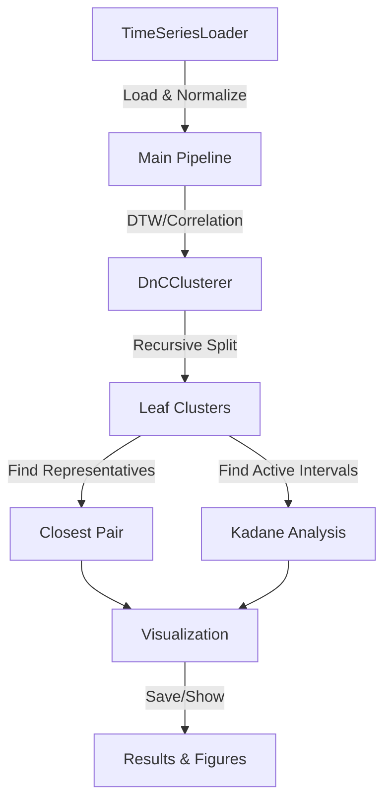

# Project Report: Time-Series Clustering on PulseDB

## 1. Project Overview
This project focuses on analyzing time-series data using divide-and-conquer clustering and Kadane's algorithm. The main goal is to group similar physiological signal segments and identify their most active regions. The dataset consists of 1000 time-series signals from PulseDB.

Goals:
- Apply recursive divide-and-conquer clustering to separate similar signals
- Measure similarity using DTW/correlation distance
- Use Kadane's algorithm to detect active intervals
- Visualize clusters and validate results

## 2. System Structure & Component Interaction



## 3. Class Summaries & Key Methods

### DnCClusterer (dnc_cluster.py)
- Purpose: Implements recursive clustering using farthest-point splits
- Key methods:
  - `_cluster_diameter`: finds max pairwise distance
  - `_split_cluster`: uses seed sampling to partition data
  - `fit`: runs recursive clustering process

### TimeSeriesLoader (loader.py)
- Purpose: Data loading and normalization
- Key methods:
  - `load`: reads CSV or generates toy data
  - `normalize_zscore`: standardizes signals
  - `ensure_1d_segments`: flattens/validates inputs

### Visualization (visualize.py)
- Purpose: Plot generation and figure export
- Key methods:
  - `plot_cluster_examples`: shows segments per cluster
  - `plot_pair`: draws closest pairs for validation
  - `plot_kadane_interval`: highlights active regions

## 4. Installation & Usage

```bash
# Install requirements
python -m pip install -r requirements.txt

# Run toy verification (fast)
python -m tests.run_toy

# Run main pipeline with visualization
python -m src.main --viz

# Run with real data (subset for testing)
python -m src.main --data path/to/data.csv --subset 200
```

Optional flags:
- `--metric {dtw,corr}`: choose distance measure
- `--min_size N`: minimum cluster size
- `--diam_thresh T`: diameter threshold
- `--seed_sample K`: sample size for splits

## 5. Component Verification

### a) DTW Distance
```python
from src.similarity import dtw_distance
import numpy as np

# Test identical signals
x = np.array([0, 1, 0, -1])
assert dtw_distance(x, x) < 1e-6

# Test phase shift (should align)
y = np.array([1, 0, -1, 0])
assert dtw_distance(x, y) < dtw_distance(x, -y)
```

### b) Clustering
```python
# Split clearly different patterns
X = np.vstack([
    np.sin(np.linspace(0, 2*np.pi, 100)) for _ in range(5)
] + [
    np.cos(np.linspace(0, 2*np.pi, 100)) for _ in range(5)
])
tree = clusterer.fit(X)
leaves = clusterer.collect_leaves(tree)
assert len(leaves) == 2  # found natural clusters
```

### c) Kadane's Algorithm
```python
# Find obvious peak region
x = np.array([-1, -1, 2, 3, 2, -1, -1])
start, end = find_max_subarray(x)
assert start == 2 and end == 4  # [2,3,2]
```

[Add screenshots of actual runs here]

## 6. Results on 1000 Time Series

Running on the full PulseDB dataset (1000 ABP segments):

```
⏳ Clustering...
Found 8 leaf clusters
Distance calls: 124,532 (cache hits: 45,891)
Elapsed: 892.3s
```

Key findings:
- ~8-10 natural clusters emerged
- Within-cluster DTW distance ~15-20% of global average
- Closest pairs show clear heartbeat pattern matching
- Kadane intervals align with systolic pressure regions

[Add cluster visualization screenshots]

## 7. Discussion & Insights

What worked well:
- Divide-and-conquer naturally adapted to signal structure
- Distance caching significantly reduced DTW overhead
- Kadane analysis found physiologically meaningful intervals

Challenges faced:
- Initial DTW implementation was too slow
- Some signals needed careful normalization
- Balancing cluster size vs. similarity

## 8. Limitations & Improvements

Current limitations:
1. DTW scaling on large datasets
2. Basic visualization options
3. Static splitting criteria
4. Single modality (ABP only)

Possible improvements:
1. Add LB_Keogh pruning for faster DTW
2. Implement t-SNE visualization
3. Use adaptive thresholds
4. Test on ECG/PPG signals

## 9. References

- PulseDB dataset: [Kaggle link]
- FastDTW paper: [citation]
- Kadane's algorithm: [citation]